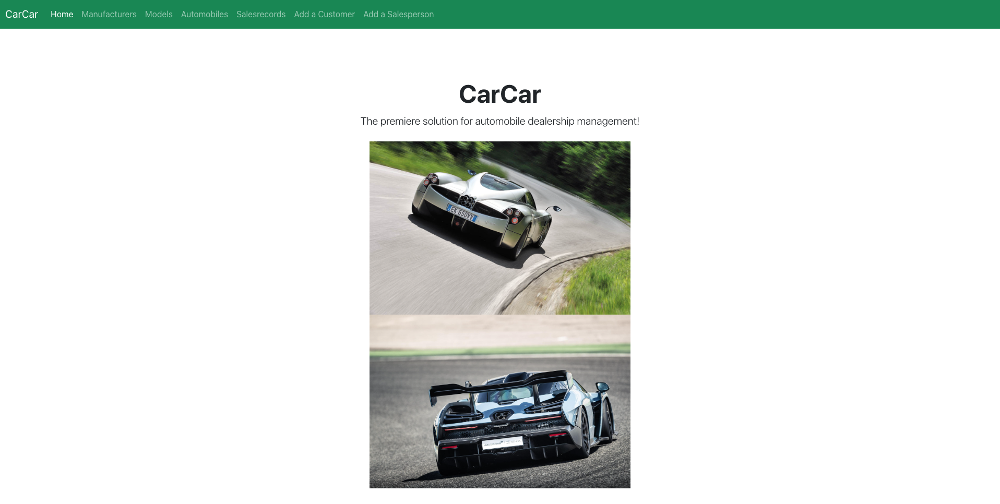
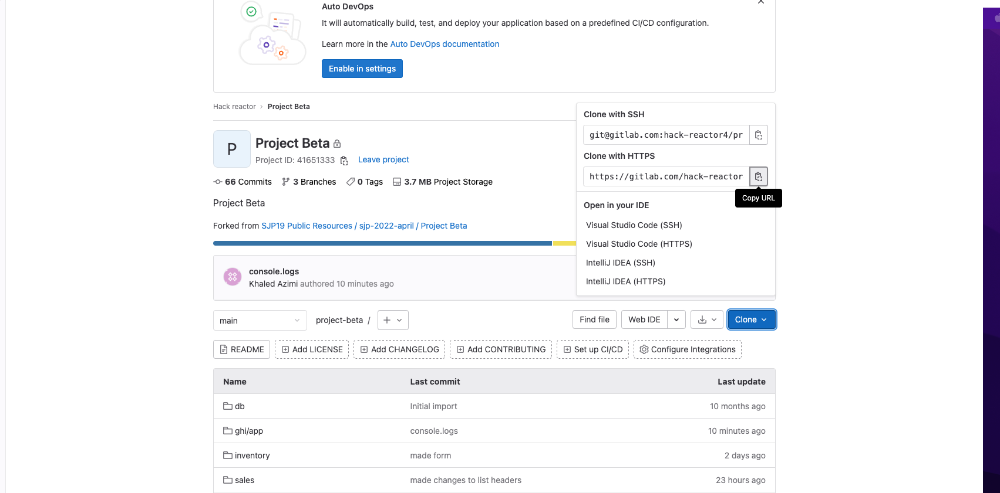

# **CarCar**




Team:

* Khaled Azimi - Sales
* Person 2 - Which microservice?

# **Steps to Run Project**

1. For the project located at https://gitlab.com/hack-reactor4/project-beta
2. Once the project is forked, clone via git clone https link.



3. Once cloned, CD into project directory and run the following commands:

    - docker volume create beta-data
    - docker-compose build
    - docker-compose up

    - When you run docker-compose up and if you're on macOS, you will see a warning about an environment variable named OS being missing. You can safely ignore this.
    - visit http://localhost:3000/ in your browser to view the React application
    - In order to work with data you can create it in insomnia.


## Service microservice

Explain your models and integration with the inventory
microservice, here.

## Sales microservice

The following models are located in the Sales microservice

**SalesRecord**

The SalesRecord model consists of the

   - **Price** of the vehicle.
   - Foreign key to the **AutomobileVO** model (this is a value object)
   - Foreign key to the **Salesperson** model
   - Foreign key to **Customer** model

This model helps us create our Salesrecords.

**AutomobileVO**

The AutomobileVO consits of the

 - Import_href, which is polled from the inventory list of automobiles
 - Color of the automobile
 - Year of the automobile
 - Vin of the vehicle
 - vehicleSold which a boolean that will update once the sale of the automobile is posted

**Salesperson**
 - Name of the sales person
 - employee_id of the salesperson which is a unique value. (Employee_id can't be used twice)

**Customer**
 - Name of the customer
 - Address of the customer
 - Phone number of the customer

Information on how to create/delete/update instances of these in an api tool such as Insomnia can be viewed below.

**Poller**

Automobiles from inventory are polled every 60 seconds which creates an AutmobileVO (valueobject) for the sales service.

**React Front End for Sales**

 - http://localhost:3000/salesrecords - Lists out all sales records
 - http://localhost:3000/salesrecord/new - Form to create a new salerecord
 - http://localhost:3000/salesrecords/history - List all salesrecords by selected salesperson
 - http://localhost:3000/customers/new - Form to create a new customer
 - http://localhost:3000/salesteam/new - Form to create a new salesperson


# **CRUD documentation**


| API | Method | Port | Result | URL
| ----------- | ----------- | ----------- | ----------- | ----------- |
| Inventory | POST | 8100 | Creates a new manufacturer  | http://localhost:8100/apimanufacturers/
| Inventory | GET | 8100 | Gets a list of all manufacturers  | http://localhost:8100/apimanufacturers/
| Inventory | PUT | 8100 | Update a specific manufactuer  | http://localhost:8100/api/manufacturers/{manufacturer.id}/
| Inventory | DELETE | 8100 | Delete a specific manufacturer  | http://localhost:8100/api/manufacturers/{manufacturer.id}/
| Inventory | POST | 8100 | Creates a new vehicle model  | http://localhost:8100/api/models/
| Inventory | GET | 8100 | Gets a list of all models  | http://localhost:8100/api/models/
| Inventory | PUT | 8100 | update a specific model  | http://localhost:8100/api/models/{model.id}/
| Inventory | DELETE | 8100 | update a specific model  | http://localhost:8100/api/models/{model.id}/
| Inventory | GET | 8100 | Creates a new automobile | http://localhost:8100/api/automobiles/
| Inventory | GET | 8100 | Gets a list of all automobiles  | http://localhost:8100/api/automobiles/
| Inventory | PUT | 8100 | Update a specific automobile | http://localhost:8100/api/automobiles/{automobile.vin}/
| Inventory | DELETE | 8100 | Delete a specific automobile | http://localhost:8100/api/automobiles/{automobile.vin}/
| Sales | GET | 8090 | Gets a list of all AutomobileVOs  | http://localhost:8090/api/automobiles/
| Sales | POST | 8090 | Creates a new customer | http://localhost:8090/api/customers/
| Sales | GET | 8090 | Gets a list of all customers | http://localhost:8090/api/customers/
| Sales | PUT | 8090 | Updates a specific customer | http://localhost:8090/api/customers/{customer.id}/
| Sales | DELET | 8090 | Delete a specific customer | http://localhost:8090/api/customers/{customer.id}/
| Sales | POST | 8090 | Creates a new salesperson| http://localhost:8090/api/salesteam/
| Sales | POST | 8090 | Gets a list of all salespeople | http://localhost:8090/api/salesteam/
| Sales | PUT | 8090 | Update a specific salesperson| http://localhost:8090/api/salesteam/{salesperson.id}/
| Sales | DELETE | 8090 | Delete a specific salesperson| http://localhost:8090/api/salesteam/{salesperson.id}/
| Sales | POST | 8090 | Creates a new sale | http://localhost:8090/api/salesteam/
| Sales | POST | 8090 | Gets a list of all sales | http://localhost:8090/api/salesteam/


# Required data to create items

Create a Manufacturer

```
{
  "name": "Pagani"
}
```

Create a Vehicle Model

```
{
  "name": "Zonda",
	"picture_url": "https://images.squarespace-cdn.com/content/v1/5f7ca9b4bb17060b028086bb/1655849043379-CA07JQG2AVPHZJ7FGDBH/TED74486.jpg",
  "manufacturer_id": 4
}
```

Create an Automobile

```
{
  "color": "blackonblackonblack",
  "year": 2012,
  "vin": "blackonblack123",
  "model_id": 1
}
```

Create a new customer

```
{
	"name": "Hack Reactsmith",
	"address": "4030 Apple Drive Fremont, CA 94555",
	"phone": "510-333-9939"
}

```

Create a new salesperson

```
{
	"name": "Big Shot",
	"employee_id": 30399
}
```

Record a new sale
```
 {  "automobile": "adfkd03092",
    "salesperson": 1,
    "customer": 1,
    "price": 13000
}

Note the boolean field of vehicleSold will update itself once a sale is posted
```
